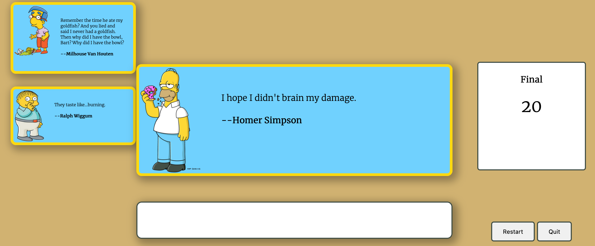
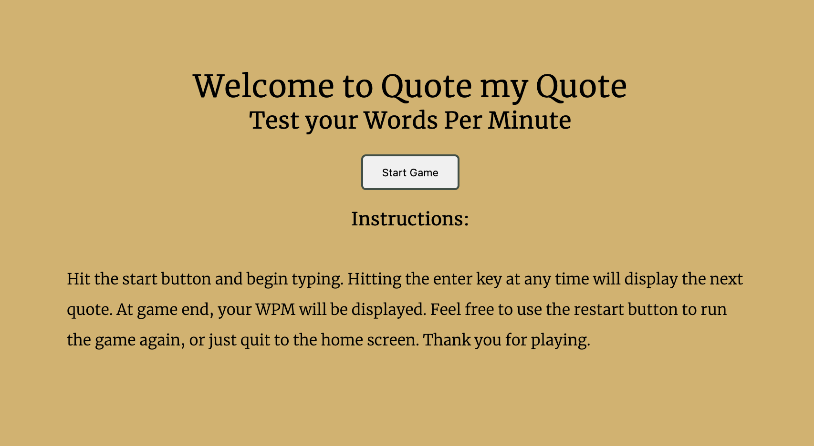

# Quote My Quote

### A game where you type out quotes to determine your Words Per Minute.

[QuoteMyQote](https://jshawndunn.github.io/QuoteMyQuote/)

# HOW TO PLAY

### Simply type out each quote and hit enter when you are done. After 15 seconds, your score will be displayed.



## Start Up Screen:


# HOW TO INSTALL

## Example
1. *`Fork`* and *`Clone`* this respository to your local machine
2. Open `index.html` in your browser to play or 
3. [QuoteMyQote](https://jshawndunn.github.io/QuoteMyQuote/) to play

# HOW IT WORKS
The core game pulls down data from https://thesimpsonsquoteapi.glitch.me/

```js
//async function to grab quotes
const getQuotes = async () => {
    //response promise object
    const response = await fetch('https://thesimpsonsquoteapi.glitch.me/quotes?count=10');
    //if error getting data
    if(response.status !== 200){
        throw new Error('cannot fetch the data');
    }
    //json promise object
    const data = await response.json();
    return data;
};
```

# FUTURE CONSIDERATIONS
Add visible timer to game screen.
Refactor code.

